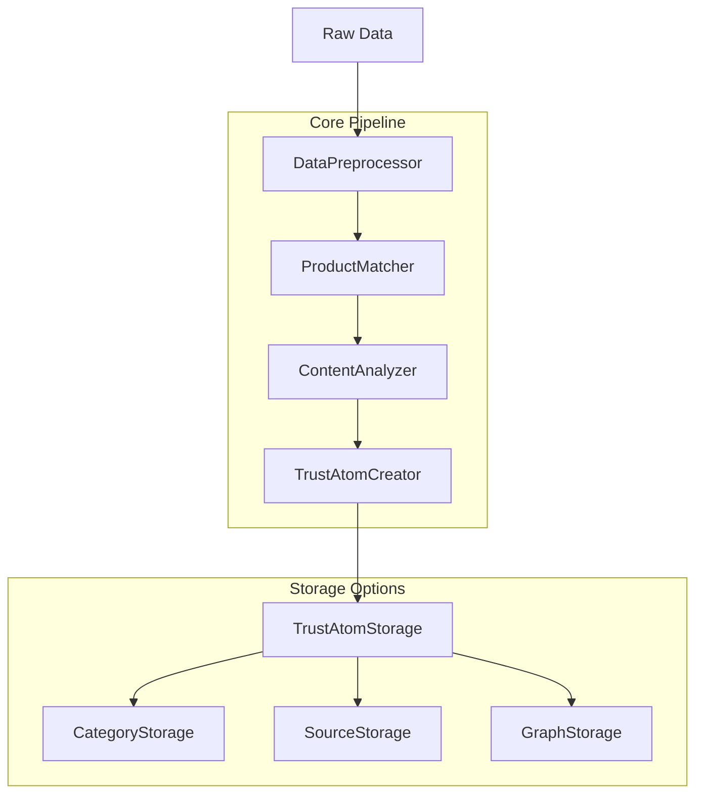

# Summarization Pipeline Refactoring Plan

This document outlines a plan for refactoring the existing summarization pipeline (`summarise.py`) to incorporate the new product matching system while maintaining its current functionality.

## Table of Contents

1. [Current Implementation Analysis](#current-implementation-analysis)
2. [Refactoring Goals](#refactoring-goals)
3. [Proposed Architecture](#proposed-architecture)
4. [Implementation Plan](#implementation-plan)
5. [Testing and Validation](#testing-and-validation)
6. [Migration Strategy](#migration-strategy)

## Current Implementation Analysis

The current `summarise.py` script has several limitations:

1. **Hardcoded Product ID**: All entries are assigned "cerave_foaming_cleanser" as the product_id, resulting in an 80-90% matching failure rate.

2. **Simple Sentiment Analysis**: Uses a basic keyword-based approach without context awareness or nuance detection.

3. **Limited Tag Extraction**: Only assigns a generic "skincare" tag without extracting specific attributes or topics.

4. **No Confidence Scoring**: Doesn't provide any indication of match quality or confidence.

5. **Fixed Output Structure**: Outputs directly to a category-specific file without flexibility for different data sources.

### Current Code Structure

```python
# Load summarization model (T5-small)
summarizer = pipeline("summarization", model="t5-small", tokenizer="t5-small")

def classify_sentiment(text):
    positive_keywords = ["love", "great", "helpful", "excellent", "perfect", "amazing"]
    negative_keywords = ["hate", "bad", "terrible", "waste", "awful", "broke"]
    text_lower = text.lower()
    if any(word in text_lower for word in positive_keywords):
        return "positive"
    elif any(word in text_lower for word in negative_keywords):
        return "negative"
    else:
        return "neutral"

# Process comments
for comment in post.get("comments", []):
    # Generate summary
    summary = summarizer("summarize: " + feedback, max_length=30, min_length=5, do_sample=False)[0]["summary_text"]
    
    # Generate sentiment
    sentiment = classify_sentiment(feedback)
    
    # Build schema entry
    structured_entry = {
        "product_id": "cerave_foaming_cleanser",
        "source": "reddit",
        "timestamp": comment.get("created_utc", post_timestamp),
        "feedback_text": feedback,
        "sentiment_label": sentiment,
        "authenticity_score": 0.85,
        "summary_text": summary,
        "metadata": {
            "username_hash": "sha256:placeholder",
            "upvotes": comment.get("score", 0),
            "permalink": post_permalink
        },
        "tags": ["skincare"]
    }
```

## Refactoring Goals

1. **Maintain Backward Compatibility**: Ensure that the refactored pipeline can still be used with existing code.

2. **Incorporate Product Matching**: Integrate the multi-stage product matching system to significantly improve matching rates.

3. **Enhance Sentiment Analysis**: Improve sentiment classification with context awareness and nuance detection.

4. **Add Tag Extraction**: Implement category-specific tag extraction for more detailed analysis.

5. **Implement Confidence Scoring**: Add confidence scores for product matches and overall Trust Atom quality.

6. **Modularize Code**: Refactor the code into reusable components for better maintainability.

7. **Support Multiple Data Sources**: Make the pipeline flexible enough to handle different data sources.

## Proposed Architecture

The refactored pipeline will follow a modular architecture with clear separation of concerns:



### Key Components

1. **DataPreprocessor**: Handles cleaning and normalization of raw data.

2. **ProductMatcher**: Implements the multi-stage matching algorithm.

3. **ContentAnalyzer**: Performs sentiment analysis and tag extraction.

4. **TrustAtomCreator**: Creates Trust Atoms from processed data.

5. **TrustAtomStorage**: Manages storage of Trust Atoms in various formats.

## Implementation Plan

### Phase 1: Refactor Existing Code (1-2 weeks)

1. **Create Base Classes**:

```python
class DataPreprocessor:
    """Preprocess raw data for further processing"""
    
    def clean_text(self, text):
        """Clean and normalize text"""
        # Remove URLs
        text = re.sub(r'https?://\S+', '', text)
        
        # Remove special characters but keep apostrophes
        text = re.sub(r'[^\w\s\']', ' ', text)
        
        # Remove extra whitespace
        text = re.sub(r'\s+', ' ', text).strip()
        
        return text
    
    def process_reddit_comment(self, comment, post_data):
        """Process a Reddit comment"""
        return {
            "text": self.clean_text(comment.get("body", "")),
            "source": "reddit",
            "timestamp": comment.get("created_utc"),
            "username": comment.get("author"),
            "score": comment.get("score", 0),
            "permalink": post_data.get("permalink"),
            "subreddit": post_data.get("subreddit"),
            "post_title": post_data.get("title")
        }
    
    def process_youtube_comment(self, comment, video_data):
        """Process a YouTube comment"""
        # Similar implementation for YouTube comments
        pass
```

2. **Implement Product Matcher**:

```python
class ProductMatcher:
    """Match products using multi-stage algorithm"""
    
    def __init__(self, product_registry_path):
        """Initialize with product registry"""
        with open(product_registry_path, "r") as f:
            self.product_registry = json.load(f)
    
    def match_product(self, text):
        """
        Match product using multi-stage algorithm
        
        Args:
            text (str): Text to match
            
        Returns:
            tuple: (product_id, match_info)
        """
        # Stage 1: Exact Alias Match
        product_id, confidence = self.exact_alias_match(text)
        if product_id and confidence > 0.8:
            return product_id, {
                "match_method": "exact_alias",
                "match_score": confidence,
                "alternative_matches": []
            }
        
        # Stage 2: Fuzzy Brand + Product Match
        product_id, confidence = self.fuzzy_brand_product_match(text)
        if product_id and confidence > 0.6:
            return product_id, {
                "match_method": "fuzzy_brand_product",
                "match_score": confidence,
                "alternative_matches": []
            }
        
        # Stage 3: Semantic Similarity
        # Implement if embeddings are available
        
        # Fallback: Log unmatched and return default
        self.log_unmatched(text)
        return "unknown_product", {
            "match_method": "fallback",
            "match_score": 0.1,
            "alternative_matches": []
        }
    
    def exact_alias_match(self, text):
        """Exact matching against product aliases"""
        text_lower = text.lower()
        
        for product_id, product in self.product_registry.items():
            # Check canonical name
            if product["canonical_name"].lower() in text_lower:
                return product_id, 0.95
                
            # Check aliases
            for alias in product.get("aliases", []):
                if alias.lower() in text_lower:
                    return product_id, 0.9
        
        return None, 0
    
    def fuzzy_brand_product_match(self, text):
        """Fuzzy matching with brand detection"""
        # Implementation details
        pass
    
    def log_unmatched(self, text):
        """Log unmatched text for registry expansion"""
        # Implementation details
        pass
```

3. **Enhance Content Analysis**:

```python
class ContentAnalyzer:
    """Analyze content for sentiment and tags"""
    
    def __init__(self, summarizer=None):
        """Initialize with optional summarizer"""
        if summarizer:
            self.summarizer = summarizer
        else:
            # Load summarization model (T5-small)
            from transformers import pipeline
            self.summarizer = pipeline("summarization", model="t5-small", tokenizer="t5-small")
    
    def analyze_sentiment(self, text):
        """
        Analyze sentiment using hybrid approach
        
        Args:
            text (str): Text to analyze
            
        Returns:
            tuple: (sentiment_label, confidence)
        """
        # Enhanced version of the existing classify_sentiment function
        positive_keywords = ["love", "great", "helpful", "excellent", "perfect", "amazing"]
        negative_keywords = ["hate", "bad", "terrible", "waste", "awful", "broke"]
        
        text_lower = text.lower()
        
        # Count sentiment keywords
        positive_count = sum(1 for word in positive_keywords if word in text_lower)
        negative_count = sum(1 for word in negative_keywords if word in text_lower)
        
        # Rule-based decision with confidence
        if positive_count > 0 and negative_count == 0:
            return "positive", 0.8
        elif negative_count > 0 and positive_count == 0:
            return "negative", 0.8
        elif positive_count > 0 and negative_count > 0:
            return "mixed", 0.7
        
        # Default to neutral with low confidence
        return "neutral", 0.5
    
    def generate_summary(self, text, max_length=30, min_length=5):
        """Generate summary of text"""
        try:
            summary = self.summarizer("summarize: " + text, max_length=max_length, min_length=min_length, do_sample=False)[0]["summary_text"]
            return summary
        except Exception as e:
            print(f"[ERROR] Could not summarize: {text[:50]}... Error: {e}")
            return "Summary failed"
    
    def extract_tags(self, text, category="skincare"):
        """Extract tags based on category"""
        # Implementation details
        pass
```

4. **Create Trust Atom Creator**:

```python
class TrustAtomCreator:
    """Create Trust Atoms from processed data"""
    
    def create_trust_atom(self, processed_data, product_match_result, content_analysis_result):
        """
        Create a Trust Atom
        
        Args:
            processed_data (dict): Preprocessed data
            product_match_result (tuple): (product_id, match_info)
            content_analysis_result (dict): Content analysis results
            
        Returns:
            dict: Trust Atom
        """
        product_id, match_info = product_match_result
        
        # Generate atom ID
        atom_id = f"{processed_data['source']}_{product_id}_{uuid.uuid4().hex[:8]}"
        
        # Create Trust Atom
        trust_atom = {
            "atom_id": atom_id,
            "product_id": product_id,
            "source": processed_data["source"],
            "timestamp": processed_data["timestamp"],
            "feedback_text": processed_data["text"],
            "summary_text": content_analysis_result["summary"],
            "sentiment_label": content_analysis_result["sentiment"],
            "authenticity_score": 0.85,  # Could be calculated based on source
            "confidence_score": match_info["match_score"],
            "tags": content_analysis_result["tags"],
            "metadata": {
                "username_hash": self._anonymize_username(processed_data.get("username")),
                "upvotes": processed_data.get("score", 0),
                "permalink": processed_data.get("permalink")
            },
            "product_match_info": match_info
        }
        
        # Add source-specific data
        if processed_data["source"] == "reddit":
            trust_atom["source_specific_data"] = {
                "reddit_data": {
                    "subreddit": processed_data.get("subreddit"),
                    "post_title": processed_data.get("post_title")
                }
            }
        elif processed_data["source"] == "youtube":
            # Add YouTube-specific data
            pass
        
        return trust_atom
    
    def _anonymize_username(self, username):
        """Anonymize username"""
        if not username:
            return "sha256:anonymous"
        
        # Simple hash for now, could be enhanced
        return f"sha256:{hashlib.sha256(username.encode()).hexdigest()[:16]}"
```

5. **Implement Storage**:

```python
class TrustAtomStorage:
    """Store Trust Atoms in various formats"""
    
    def store_by_category(self, trust_atom, base_path="trustlayer_plugin/data/categories"):
        """Store Trust Atom by category"""
        # Get category from product ID
        category = self._get_category(trust_atom["product_id"])
        
        # Create path
        category_path = os.path.join(base_path, f"{category}.json")
        
        # Ensure directory exists
        os.makedirs(os.path.dirname(category_path), exist_ok=True)
        
        # Load existing data
        existing_data = []
        if os.path.exists(category_path):
            with open(category_path, "r") as f:
                existing_data = json.load(f)
        
        # Add new Trust Atom
        existing_data.append(trust_atom)
        
        # Save updated data
        with open(category_path, "w") as f:
            json.dump(existing_data, f, indent=2)
    
    def store_by_source(self, trust_atom, base_path="trustlayer_plugin/data/sources"):
        """Store Trust Atom by source"""
        # Similar implementation for source-based storage
        pass
    
    def store_as_trust_atoms(self, trust_atom, base_path="trustlayer_plugin/data/trust_atoms"):
        """Store in Trust Atoms collection"""
        # Similar implementation for Trust Atoms storage
        pass
    
    def _get_category(self, product_id):
        """Get category from product ID"""
        # This would use the product registry to look up the category
        # For now, default to skincare
        return "skincare"
```

### Phase 2: Create Main Pipeline (1 week)

```python
class SummarizationPipeline:
    """Main pipeline for processing data"""
    
    def __init__(self, product_registry_path="trustlayer_plugin/data/registry/product_registry_detailed.json"):
        """Initialize pipeline components"""
        self.preprocessor = DataPreprocessor()
        self.product_matcher = ProductMatcher(product_registry_path)
        self.content_analyzer = ContentAnalyzer()
        self.trust_atom_creator = TrustAtomCreator()
        self.storage = TrustAtomStorage()
    
    def process_reddit_data(self, input_path, output_path=None, max_items=None):
        """
        Process Reddit data
        
        Args:
            input_path (str): Path to input JSON file
            output_path (str, optional): Path to output file
            max_items (int, optional): Maximum number of items to process
            
        Returns:
            list: Processed Trust Atoms
        """
        # Load input data
        with open(input_path, "r") as f:
            raw_data = json.load(f)
        
        trust_atoms = []
        count = 0
        
        for post in raw_data:
            post_data = {
                "permalink": post.get("permalink", "https://reddit.com"),
                "timestamp": post.get("created_utc"),
                "subreddit": post.get("subreddit"),
                "title": post.get("title")
            }
            
            for comment in post.get("comments", []):
                if max_items and count >= max_items:
                    break
                
                # Skip empty comments
                if not comment.get("body", "").strip():
                    continue
                
                # Step 1: Preprocess data
                processed_data = self.preprocessor.process_reddit_comment(comment, post_data)
                
                # Step 2: Match product
                product_match_result = self.product_matcher.match_product(processed_data["text"])
                
                # Step 3: Analyze content
                sentiment, sentiment_confidence = self.content_analyzer.analyze_sentiment(processed_data["text"])
                summary = self.content_analyzer.generate_summary(processed_data["text"])
                tags = self.content_analyzer.extract_tags(processed_data["text"])
                
                content_analysis_result = {
                    "sentiment": sentiment,
                    "sentiment_confidence": sentiment_confidence,
                    "summary": summary,
                    "tags": tags
                }
                
                # Step 4: Create Trust Atom
                trust_atom = self.trust_atom_creator.create_trust_atom(
                    processed_data,
                    product_match_result,
                    content_analysis_result
                )
                
                # Step 5: Store Trust Atom
                if output_path:
                    # Store in specified output path (backward compatibility)
                    self._store_in_output_path(trust_atom, output_path)
                else:
                    # Store in category-specific file
                    self.storage.store_by_category(trust_atom)
                
                trust_atoms.append(trust_atom)
                count += 1
                
                if max_items and count >= max_items:
                    break
        
        return trust_atoms
    
    def process_youtube_data(self, input_path, output_path=None, max_items=None):
        """Process YouTube data"""
        # Similar implementation for YouTube data
        pass
    
    def _store_in_output_path(self, trust_atom, output_path):
        """Store Trust Atom in specified output path"""
        # Ensure directory exists
        os.makedirs(os.path.dirname(output_path), exist_ok=True)
        
        # Load existing data
        existing_data = []
        if os.path.exists(output_path):
            with open(output_path, "r") as f:
                existing_data = json.load(f)
        
        # Add new Trust Atom
        existing_data.append(trust_atom)
        
        # Save updated data
        with open(output_path, "w") as f:
            json.dump(existing_data, f, indent=2)
```

### Phase 3: Create Backward-Compatible Interface (1 week)

```python
def summarize_reddit_data(input_path, output_path, max_comments=10):
    """
    Backward-compatible function for summarizing Reddit data
    
    Args:
        input_path (str): Path to input JSON file
        output_path (str): Path to output file
        max_comments (int, optional): Maximum number of comments to process
    """
    pipeline = SummarizationPipeline()
    trust_atoms = pipeline.process_reddit_data(input_path, output_path, max_comments)
    print(f"[OK] Wrote {len(trust_atoms)} structured entries to {output_path}")
```

## Testing and Validation

### Unit Tests

1. **Component Tests**:
   - Test each component individually with sample data
   - Verify correct behavior for edge cases

2. **Integration Tests**:
   - Test the entire pipeline with sample data
   - Verify correct output format and content

3. **Backward Compatibility Tests**:
   - Test with existing code that uses the current implementation
   - Verify that results are compatible with existing systems

### Validation Metrics

1. **Product Matching Accuracy**:
   - Measure improvement in matching rate
   - Compare with manual matching for a sample dataset

2. **Sentiment Analysis Accuracy**:
   - Compare with human-labeled sentiment
   - Measure improvement over the current implementation

3. **Performance Benchmarks**:
   - Measure processing time for various dataset sizes
   - Ensure acceptable performance for production use

## Migration Strategy

### Phase 1: Parallel Operation (1-2 weeks)

1. **Deploy New Pipeline**:
   - Deploy the refactored pipeline alongside the existing one
   - Process the same data with both pipelines

2. **Compare Results**:
   - Compare output from both pipelines
   - Identify and address any discrepancies

3. **Validate Improvements**:
   - Measure improvement in matching rate
   - Verify enhanced sentiment analysis and tag extraction

### Phase 2: Gradual Migration (2-3 weeks)

1. **Update Dependent Systems**:
   - Modify systems that consume the output to handle the new format
   - Ensure backward compatibility where needed

2. **Migrate Data Sources**:
   - Gradually migrate each data source to the new pipeline
   - Monitor for any issues or regressions

3. **Deprecate Old Pipeline**:
   - Once all systems are migrated, deprecate the old pipeline
   - Maintain backward compatibility for a transition period

### Phase 3: Full Adoption (1-2 weeks)

1. **Complete Migration**:
   - Ensure all systems are using the new pipeline
   - Remove backward compatibility layers if no longer needed

2. **Documentation and Training**:
   - Update documentation for the new pipeline
   - Train team members on the new architecture

3. **Continuous Improvement**:
   - Establish monitoring and feedback mechanisms
   - Plan for future enhancements based on performance data

## Conclusion

This refactoring plan provides a clear path to enhancing the summarization pipeline with the new product matching system while maintaining backward compatibility. By following a modular approach with clear separation of concerns, we can significantly improve the quality of the output while making the code more maintainable and extensible.

The key improvements include:
- Replacing hardcoded product IDs with a sophisticated multi-stage matching system
- Enhancing sentiment analysis with confidence scoring
- Adding category-specific tag extraction
- Implementing a flexible storage system for Trust Atoms
- Providing backward compatibility for existing systems

This refactored pipeline will serve as a solid foundation for the TrustGraph architecture, enabling more sophisticated trust analysis and insights.