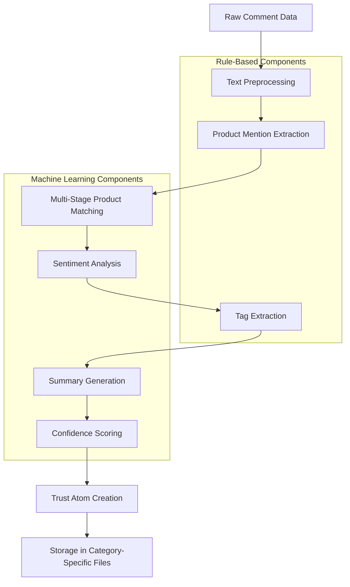

# Trust Atom Schema and Implementation Plan

This document outlines the detailed schema for Trust Atoms, the fundamental building blocks of the TrustGraph, and provides a comprehensive plan for handling unstructured data from sources like Reddit and YouTube.

## Trust Atom Schema

The Trust Atom schema extends the existing product feedback structure with enhanced metadata capture and confidence scoring to address the product matching issues identified in the current implementation.

### JSON Schema Definition

```json
{
  "$schema": "http://json-schema.org/draft-07/schema#",
  "title": "TrustAtom",
  "description": "Atomic unit of structured user trust evidence for the TrustGraph",
  "type": "object",
  "required": [
    "atom_id",
    "product_id",
    "source",
    "timestamp",
    "feedback_text",
    "summary_text",
    "sentiment_label",
    "authenticity_score",
    "confidence_score",
    "tags",
    "metadata",
    "product_match_info"
  ],
  "properties": {
    "atom_id": {
      "type": "string",
      "description": "Unique identifier for the Trust Atom (e.g., 'reddit_cerave_12345')"
    },
    "product_id": {
      "type": "string",
      "description": "Canonical product ID from the product registry (e.g., 'cerave_foaming_cleanser_12oz')"
    },
    "source": {
      "type": "string",
      "enum": ["reddit", "youtube", "amazon", "forum", "twitter", "tiktok"],
      "description": "Platform or source of the feedback"
    },
    "timestamp": {
      "type": "string",
      "format": "date-time",
      "description": "UTC timestamp of when the feedback was created"
    },
    "feedback_text": {
      "type": "string",
      "description": "Original user feedback text"
    },
    "summary_text": {
      "type": "string",
      "description": "AI-generated summary of the feedback"
    },
    "sentiment_label": {
      "type": "string",
      "enum": ["positive", "negative", "neutral", "mixed"],
      "description": "Overall sentiment classification"
    },
    "authenticity_score": {
      "type": "number",
      "minimum": 0,
      "maximum": 1,
      "description": "Confidence score for the authenticity of the feedback (0.0-1.0)"
    },
    "confidence_score": {
      "type": "number",
      "minimum": 0,
      "maximum": 1,
      "description": "Overall confidence in the product match (0.0-1.0)"
    },
    "tags": {
      "type": "array",
      "items": {
        "type": "string"
      },
      "description": "Extracted topics, attributes, or categories from the feedback"
    },
    "metadata": {
      "type": "object",
      "required": ["username_hash"],
      "properties": {
        "username_hash": {
          "type": "string",
          "description": "Anonymized hash of the username"
        },
        "upvotes": {
          "type": "integer",
          "description": "Number of upvotes or likes"
        },
        "permalink": {
          "type": "string",
          "format": "uri",
          "description": "URL to the original content"
        },
        "verified_purchase": {
          "type": "boolean",
          "description": "Whether the feedback is from a verified purchaser"
        },
        "comment_id": {
          "type": "string",
          "description": "Platform-specific identifier for the comment"
        }
      }
    },
    "product_match_info": {
      "type": "object",
      "required": ["match_method", "match_score"],
      "properties": {
        "match_method": {
          "type": "string",
          "enum": ["exact_alias", "fuzzy_brand_product", "semantic_similarity", "manual"],
          "description": "Method used to match the product"
        },
        "match_score": {
          "type": "number",
          "minimum": 0,
          "maximum": 1,
          "description": "Confidence score for the product match (0.0-1.0)"
        },
        "alternative_matches": {
          "type": "array",
          "items": {
            "type": "object",
            "properties": {
              "product_id": {
                "type": "string",
                "description": "Alternative product ID"
              },
              "score": {
                "type": "number",
                "minimum": 0,
                "maximum": 1,
                "description": "Match score for this alternative"
              }
            }
          },
          "description": "Alternative product matches with lower confidence"
        },
        "context_factors": {
          "type": "object",
          "properties": {
            "brand_mentioned": {
              "type": "boolean",
              "description": "Whether the brand was explicitly mentioned"
            },
            "product_type_mentioned": {
              "type": "boolean",
              "description": "Whether the product type was explicitly mentioned"
            },
            "identifier_mentioned": {
              "type": "boolean",
              "description": "Whether a product identifier (UPC, ASIN) was mentioned"
            }
          },
          "description": "Contextual factors that influenced the match confidence"
        }
      },
      "description": "Detailed information about the product matching process"
    },
    "source_specific_data": {
      "type": "object",
      "properties": {
        "reddit_data": {
          "type": "object",
          "properties": {
            "subreddit": {
              "type": "string",
              "description": "Subreddit where the comment was posted"
            },
            "post_title": {
              "type": "string",
              "description": "Title of the post containing the comment"
            },
            "post_score": {
              "type": "integer",
              "description": "Score of the parent post"
            }
          }
        },
        "youtube_data": {
          "type": "object",
          "properties": {
            "video_title": {
              "type": "string",
              "description": "Title of the video"
            },
            "channel_name": {
              "type": "string",
              "description": "Name of the YouTube channel"
            },
            "video_views": {
              "type": "integer",
              "description": "Number of views on the video"
            },
            "timestamp_in_video": {
              "type": "string",
              "description": "Timestamp where the comment refers to (if applicable)"
            }
          }
        },
        "amazon_data": {
          "type": "object",
          "properties": {
            "product_title": {
              "type": "string",
              "description": "Title of the product being reviewed"
            },
            "star_rating": {
              "type": "number",
              "minimum": 1,
              "maximum": 5,
              "description": "Star rating given by the reviewer (1-5)"
            },
            "review_title": {
              "type": "string",
              "description": "Title of the review"
            }
          }
        }
      },
      "description": "Source-specific metadata that varies by platform"
    }
  }
}
```

## Unstructured Data Processing Pipeline

To handle unstructured data from Reddit and YouTube comments, we'll implement a hybrid approach that combines rule-based extraction with machine learning for confidence scoring and validation.

### Pipeline Architecture



### Component Details

#### 1. Text Preprocessing

```python
def preprocess_text(text):
    """
    Clean and normalize text for further processing
    
    Args:
        text (str): Raw text from comment or post
        
    Returns:
        str: Preprocessed text
    """
    # Remove URLs
    text = re.sub(r'https?://\S+', '', text)
    
    # Remove special characters but keep apostrophes for contractions
    text = re.sub(r'[^\w\s\']', ' ', text)
    
    # Remove extra whitespace
    text = re.sub(r'\s+', ' ', text).strip()
    
    return text
```

#### 2. Product Mention Extraction

```python
def extract_product_mentions(text, product_registry):
    """
    Extract potential product mentions from text
    
    Args:
        text (str): Preprocessed text
        product_registry (dict): Product registry with aliases
        
    Returns:
        list: Potential product mentions
    """
    mentions = []
    
    # Extract sentences for context
    sentences = nltk.sent_tokenize(text)
    
    for sentence in sentences:
        # Check for brand mentions
        for product_id, product in product_registry.items():
            brand = product.get("brand", "").lower()
            if brand and brand in sentence.lower():
                mentions.append({
                    "text": sentence,
                    "brand": brand,
                    "context": sentence
                })
                
        # Check for product type mentions
        for product_id, product in product_registry.items():
            product_type = product.get("type", "").lower()
            if product_type and product_type in sentence.lower():
                mentions.append({
                    "text": sentence,
                    "product_type": product_type,
                    "context": sentence
                })
    
    return mentions
```

#### 3. Multi-Stage Product Matching

This component implements the cascading matching algorithm described in the implementation plan:

1. Exact Alias Match
2. Brand + Product Fuzzy Match
3. Semantic Similarity Match
4. Unmatched Logging

```python
def match_product(mention, product_registry, embeddings=None):
    """
    Multi-stage product matching with confidence scoring
    
    Args:
        mention (dict): Extracted product mention
        product_registry (dict): Product registry
        embeddings (dict, optional): Pre-computed product embeddings
        
    Returns:
        tuple: (product_id, match_info) or (None, None) if no match
    """
    # Stage 1: Exact Alias Match
    product_id, confidence = exact_alias_match(mention["text"], product_registry)
    if product_id and confidence > 0.8:
        return product_id, {
            "match_method": "exact_alias",
            "match_score": confidence,
            "alternative_matches": [],
            "context_factors": {
                "brand_mentioned": mention.get("brand") is not None,
                "product_type_mentioned": mention.get("product_type") is not None,
                "identifier_mentioned": False  # Would need to check for identifiers
            }
        }
    
    # Stage 2: Fuzzy Brand + Product Match
    product_id, confidence = fuzzy_brand_product_match(mention["text"], product_registry)
    if product_id and confidence > 0.6:
        return product_id, {
            "match_method": "fuzzy_brand_product",
            "match_score": confidence,
            "alternative_matches": [],  # Would populate with other close matches
            "context_factors": {
                "brand_mentioned": mention.get("brand") is not None,
                "product_type_mentioned": mention.get("product_type") is not None,
                "identifier_mentioned": False
            }
        }
    
    # Stage 3: Semantic Similarity (if embeddings provided)
    if embeddings:
        product_id, confidence = semantic_similarity_match(mention["text"], product_registry, embeddings)
        if product_id and confidence > 0.5:
            return product_id, {
                "match_method": "semantic_similarity",
                "match_score": confidence,
                "alternative_matches": [],  # Would populate with other close matches
                "context_factors": {
                    "brand_mentioned": mention.get("brand") is not None,
                    "product_type_mentioned": mention.get("product_type") is not None,
                    "identifier_mentioned": False
                }
            }
    
    # Stage 4: Log unmatched for registry expansion
    log_unmatched(mention["text"])
    return None, None
```

#### 4. Sentiment Analysis

```python
def analyze_sentiment(text):
    """
    Analyze sentiment of text using a hybrid approach
    
    Args:
        text (str): Preprocessed text
        
    Returns:
        tuple: (sentiment_label, confidence)
    """
    # Rule-based approach for clear sentiment indicators
    positive_keywords = ["love", "great", "excellent", "amazing", "perfect", "recommend"]
    negative_keywords = ["hate", "terrible", "awful", "disappointing", "waste", "avoid"]
    
    text_lower = text.lower()
    
    # Count sentiment keywords
    positive_count = sum(1 for word in positive_keywords if word in text_lower)
    negative_count = sum(1 for word in negative_keywords if word in text_lower)
    
    # Rule-based decision
    if positive_count > 0 and negative_count == 0:
        return "positive", 0.8
    elif negative_count > 0 and positive_count == 0:
        return "negative", 0.8
    elif positive_count > 0 and negative_count > 0:
        return "mixed", 0.7
    
    # Fall back to ML-based sentiment analysis for more nuanced cases
    # This would use a pre-trained sentiment model
    # sentiment, confidence = ml_sentiment_model.predict(text)
    
    # For now, default to neutral with low confidence
    return "neutral", 0.5
```

#### 5. Tag Extraction

```python
def extract_tags(text, category="skincare"):
    """
    Extract relevant tags from text based on category
    
    Args:
        text (str): Preprocessed text
        category (str): Product category for domain-specific tags
        
    Returns:
        list: Extracted tags
    """
    tags = []
    
    # Category-specific tag dictionaries
    tag_dictionaries = {
        "skincare": {
            "skin_types": ["oily", "dry", "combination", "sensitive", "acne-prone"],
            "concerns": ["acne", "wrinkles", "redness", "dark spots", "blackheads"],
            "ingredients": ["retinol", "vitamin c", "hyaluronic acid", "niacinamide", "salicylic acid"]
        },
        "food": {
            "flavors": ["sweet", "savory", "spicy", "bitter", "sour"],
            "dietary": ["vegan", "gluten-free", "keto", "organic", "non-gmo"],
            "texture": ["crunchy", "smooth", "creamy", "crispy", "chewy"]
        }
    }
    
    # Get relevant dictionaries for the category
    category_dict = tag_dictionaries.get(category, {})
    
    # Check for matches in each tag type
    for tag_type, tag_list in category_dict.items():
        for tag in tag_list:
            if tag in text.lower():
                tags.append(tag)
    
    return tags
```

#### 6. Trust Atom Creation

```python
def create_trust_atom(feedback, product_match_result, sentiment_result, tags):
    """
    Create a Trust Atom from processed data
    
    Args:
        feedback (dict): Raw feedback data
        product_match_result (tuple): (product_id, match_info)
        sentiment_result (tuple): (sentiment_label, confidence)
        tags (list): Extracted tags
        
    Returns:
        dict: Trust Atom
    """
    product_id, match_info = product_match_result
    sentiment_label, sentiment_confidence = sentiment_result
    
    # Generate a unique atom ID
    atom_id = f"{feedback['source']}_{product_id}_{uuid.uuid4().hex[:8]}"
    
    # Calculate overall confidence score
    # Weighted average of match confidence and sentiment confidence
    overall_confidence = 0.7 * match_info["match_score"] + 0.3 * sentiment_confidence
    
    # Create the Trust Atom
    atom = {
        "atom_id": atom_id,
        "product_id": product_id,
        "source": feedback['source'],
        "timestamp": feedback['timestamp'],
        "feedback_text": feedback['text'],
        "summary_text": summarize_text(feedback['text']),
        "sentiment_label": sentiment_label,
        "authenticity_score": calculate_authenticity(feedback),
        "confidence_score": overall_confidence,
        "tags": tags,
        "metadata": {
            "username_hash": anonymize_username(feedback.get('username')),
            "upvotes": feedback.get('score', 0),
            "permalink": feedback.get('permalink')
        },
        "product_match_info": match_info,
        "source_specific_data": {}
    }
    
    # Add source-specific data
    if feedback['source'] == 'reddit':
        atom["source_specific_data"]["reddit_data"] = {
            "subreddit": feedback.get('subreddit'),
            "post_title": feedback.get('post_title'),
            "post_score": feedback.get('post_score', 0)
        }
    elif feedback['source'] == 'youtube':
        atom["source_specific_data"]["youtube_data"] = {
            "video_title": feedback.get('video_title'),
            "channel_name": feedback.get('channel_name'),
            "video_views": feedback.get('video_views', 0),
            "timestamp_in_video": feedback.get('timestamp_in_video')
        }
    
    return atom
```

## Implementation Plan for Handling Unstructured Data

### Phase 1: Data Collection and Preprocessing (1-2 weeks)

1. **Enhance Data Collection**
   - Modify Reddit scraper to capture more context (subreddit, post title)
   - Implement YouTube comment scraper with video metadata
   - Create unified data format for multi-source ingestion

2. **Preprocessing Pipeline**
   - Implement text cleaning and normalization
   - Develop entity recognition for product and brand mentions
   - Create validation mechanisms for data quality

### Phase 2: Product Matching System (2-3 weeks)

1. **Canonical Product Registry**
   - Create enriched product registry with aliases and identifiers
   - Implement registry update mechanisms for new products
   - Develop category-specific registry builders

2. **Multi-Stage Matching Algorithm**
   - Implement exact alias matching
   - Develop fuzzy brand + product matching
   - Integrate semantic similarity matching with embeddings
   - Create logging system for unmatched mentions

3. **Confidence Scoring**
   - Implement match validation with contextual factors
   - Develop confidence adjustment based on mention context
   - Create visualization tools for match quality analysis

### Phase 3: Trust Atom Production (2-3 weeks)

1. **Sentiment and Tag Analysis**
   - Enhance sentiment analysis with ML models
   - Implement category-specific tag extraction
   - Develop authenticity scoring mechanisms

2. **Trust Atom Creation**
   - Implement Trust Atom generation pipeline
   - Create validation against schema
   - Develop storage in category-specific files

3. **Integration with Existing Systems**
   - Refactor summarization pipeline to use Trust Atoms
   - Update plugin to display confidence scores
   - Implement backward compatibility layer

### Phase 4: TrustGraph Foundation (3-4 weeks)

1. **Graph Data Structures**
   - Implement basic graph representation
   - Develop relationship extraction from Trust Atoms
   - Create visualization tools for the graph

2. **Query Mechanisms**
   - Implement graph traversal for related products
   - Develop aggregation for multi-source trust
   - Create API endpoints for graph queries

3. **Learning Loop**
   - Implement feedback collection for match quality
   - Develop registry expansion from unmatched mentions
   - Create continuous improvement mechanisms

## Technical Considerations

1. **Performance**
   - Optimize matching algorithms for large product registries
   - Implement caching for frequently accessed products
   - Consider batch processing for historical data

2. **Scalability**
   - Design for horizontal scaling of processing pipeline
   - Implement sharding for category-specific data
   - Consider distributed processing for large datasets

3. **Data Quality**
   - Implement validation at each pipeline stage
   - Create monitoring for match quality metrics
   - Develop feedback loops for continuous improvement

4. **Privacy**
   - Ensure proper anonymization of user data
   - Implement data retention policies
   - Create audit trails for data processing

5. **Integration**
   - Maintain backward compatibility with existing systems
   - Design clean interfaces for new components
   - Create documentation for integration points

## Next Steps

1. Implement the Trust Atom schema as a JSON Schema file
2. Develop a prototype of the unstructured data processing pipeline
3. Test with sample data from Reddit and YouTube
4. Refine the confidence scoring system based on results
5. Integrate with the existing TrustLayer infrastructure