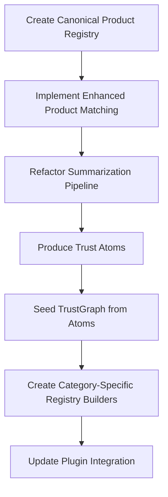
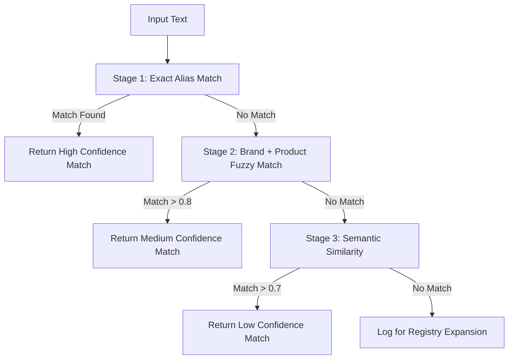
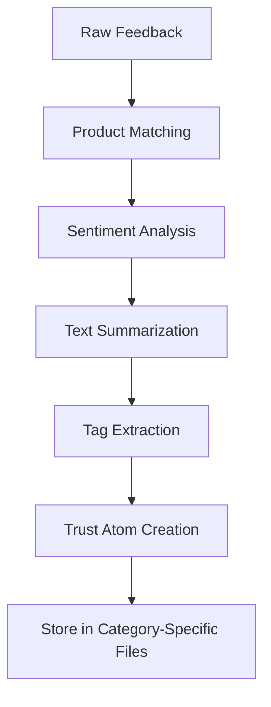
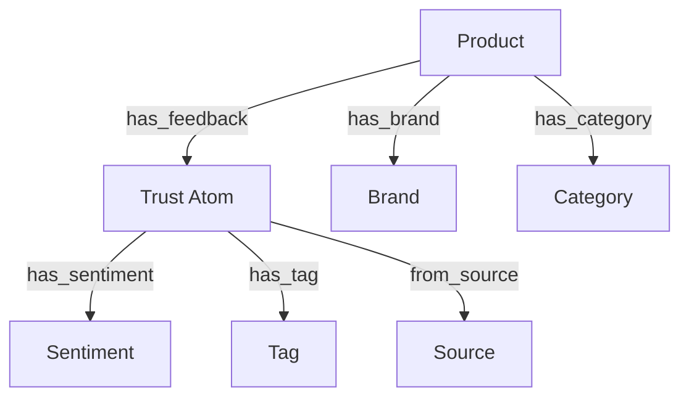
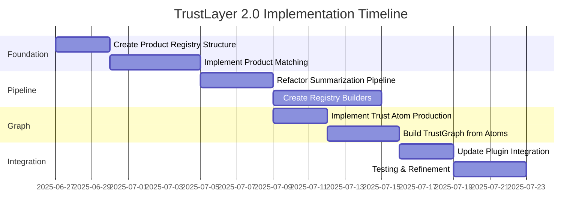

# TrustLayer 2.0: Implementation Plan for TrustGraph-Based Architecture

This document outlines the detailed implementation plan for transitioning TrustLayer to a TrustGraph-based architecture, with special emphasis on solving the 80-90% product matching failure rate and establishing a robust Trust Atom foundation.

## Table of Contents

1. [Current State Analysis](#current-state-analysis)
2. [Implementation Plan Overview](#implementation-plan-overview)
3. [Enhanced Product Matching System](#enhanced-product-matching-system)
4. [Trust Atoms & TrustGraph Integration](#trust-atoms--trustgraph-integration)
5. [Implementation Timeline](#implementation-timeline)
6. [Technical Considerations](#technical-considerations)

## Current State Analysis

The current TrustLayer implementation has several limitations:

1. **Product Matching**: There's no dedicated product registry or matching system. The `summarise.py` script hardcodes "cerave_foaming_cleanser" as the product_id for all entries, resulting in an 80-90% matching failure rate.

2. **Data Structure**: The current data structure in `skincare.json` is close to the proposed "Trust Atom" structure but lacks key fields and relationships needed for graph-based analysis.

3. **Architecture**: The system uses a simple file-based approach without the graph-based relationships needed for more sophisticated trust analysis.

## Implementation Plan Overview



## Enhanced Product Matching System

Addressing the 80-90% matching failure rate requires a sophisticated multi-stage matching system that combines several techniques.

### 1. Canonical Product Registry Structure

```json
{
  "cerave_foaming_cleanser_12oz": {
    "product_id": "cerave_foaming_cleanser_12oz",
    "canonical_name": "CeraVe Foaming Facial Cleanser",
    "brand": "CeraVe",
    "category": "skincare",
    "type": "cleanser",
    "aliases": [
      "cerave foaming cleanser",
      "cerave face wash",
      "cerave foaming cleanser 12oz",
      "cerave cleanser"
    ],
    "identifiers": {
      "asin": "B01N1LL62W",
      "upc": "301871239012",
      "openfoods_id": null,
      "usda_id": null
    },
    "status": "active",
    "verification_sources": ["amazon", "cerave.com"]
  }
}
```

### 2. Multi-Stage Matching Algorithm

The matching algorithm will use a cascading approach with multiple fallback strategies:



#### Stage 1: Exact Alias Lookup (Highest Confidence)

```python
def exact_alias_match(mention_text, registry):
    """
    Perform exact matching against product aliases
    
    Args:
        mention_text (str): Text mentioning a product
        registry (dict): Product registry
        
    Returns:
        tuple: (product_id, confidence) or (None, 0) if no match
    """
    mention_lower = mention_text.lower()
    
    # First try direct product name matches
    for product_id, product in registry.items():
        # Check canonical name
        if product["canonical_name"].lower() in mention_lower:
            return product_id, 0.95
            
        # Check aliases
        for alias in product.get("aliases", []):
            if alias.lower() in mention_lower:
                return product_id, 0.9
                
    return None, 0
```

#### Stage 2: Brand + Product Fuzzy Matching

```python
def fuzzy_brand_product_match(mention_text, registry):
    """
    Perform fuzzy matching with brand detection
    
    Args:
        mention_text (str): Text mentioning a product
        registry (dict): Product registry
        
    Returns:
        tuple: (product_id, confidence) or (None, 0) if no match
    """
    mention_lower = mention_text.lower()
    best_match = None
    best_score = 0
    
    # First detect if any brands are mentioned
    mentioned_brands = []
    for product_id, product in registry.items():
        brand = product.get("brand", "").lower()
        if brand and brand in mention_lower:
            mentioned_brands.append(brand)
    
    # If brands found, prioritize products from those brands
    if mentioned_brands:
        for product_id, product in registry.items():
            if product.get("brand", "").lower() in mentioned_brands:
                # Use fuzzy matching on product name
                canonical = product["canonical_name"].lower()
                score = fuzz.partial_ratio(canonical, mention_lower) / 100
                
                # Boost score for brand match
                score = score * 1.2
                
                if score > best_score:
                    best_score = score
                    best_match = product_id
    else:
        # No brand detected, try fuzzy matching on all products
        for product_id, product in registry.items():
            canonical = product["canonical_name"].lower()
            score = fuzz.partial_ratio(canonical, mention_lower) / 100
            
            if score > best_score:
                best_score = score
                best_match = product_id
    
    return best_match, best_score
```

#### Stage 3: Semantic Similarity (Using Embeddings)

```python
def semantic_similarity_match(mention_text, registry, embeddings):
    """
    Use vector embeddings to find semantically similar products
    
    Args:
        mention_text (str): Text mentioning a product
        registry (dict): Product registry
        embeddings (dict): Pre-computed product embeddings
        
    Returns:
        tuple: (product_id, confidence) or (None, 0) if no match
    """
    # Get embedding for the mention text
    mention_embedding = get_embedding(mention_text)
    
    best_match = None
    best_score = 0
    
    # Compare with all product embeddings
    for product_id, product_embedding in embeddings.items():
        score = cosine_similarity(mention_embedding, product_embedding)
        
        if score > best_score:
            best_score = score
            best_match = product_id
    
    return best_match, best_score
```

#### Stage 4: Unmatched Logging for Registry Expansion

```python
def log_unmatched(mention_text):
    """
    Log unmatched product mentions for future registry expansion
    
    Args:
        mention_text (str): Unmatched product mention
    """
    log_path = "trustlayer_plugin/data/registry/registry_suggestions.json"
    
    # Create directory if it doesn't exist
    os.makedirs(os.path.dirname(log_path), exist_ok=True)
    
    # Load existing suggestions
    suggestions = []
    if os.path.exists(log_path):
        with open(log_path, "r") as f:
            suggestions = json.load(f)
    
    # Add new suggestion
    suggestions.append({
        "mention_text": mention_text,
        "timestamp": datetime.now().isoformat(),
        "status": "unprocessed"
    })
    
    # Save updated suggestions
    with open(log_path, "w") as f:
        json.dump(suggestions, f, indent=2)
```

### 3. Alias Generation System

To improve matching rates, we'll implement systematic alias generation:

```python
def generate_aliases(product):
    """
    Generate comprehensive aliases for a product
    
    Args:
        product (dict): Product data
        
    Returns:
        list: Generated aliases
    """
    aliases = set()
    
    # Add basic variations
    canonical = product["canonical_name"]
    brand = product.get("brand", "")
    
    # Brand variations
    if brand:
        aliases.add(canonical.replace(brand, "").strip())
        aliases.add(canonical.lower())
        
        # Brand abbreviations
        if " " in brand:
            abbrev = "".join(word[0] for word in brand.split())
            aliases.add(canonical.replace(brand, abbrev))
    
    # Size variations
    for size in ["small", "medium", "large", "travel size", "mini"]:
        if size in canonical.lower():
            aliases.add(canonical.lower().replace(size, "").strip())
    
    # Category-specific patterns
    if product.get("category") == "skincare":
        # Skincare-specific aliases
        if "cleanser" in canonical.lower():
            aliases.add(canonical.lower().replace("cleanser", "face wash"))
            aliases.add(canonical.lower().replace("cleanser", "wash"))
        
        if "moisturizer" in canonical.lower():
            aliases.add(canonical.lower().replace("moisturizer", "cream"))
            aliases.add(canonical.lower().replace("moisturizer", "lotion"))
    
    return list(aliases)
```

### 4. Confidence Scoring and Validation

```python
def validate_match(product_id, mention_text, confidence, registry):
    """
    Validate and potentially adjust confidence score based on additional factors
    
    Args:
        product_id (str): Matched product ID
        mention_text (str): Original text mention
        confidence (float): Initial confidence score
        registry (dict): Product registry
        
    Returns:
        float: Adjusted confidence score
    """
    if product_id not in registry:
        return 0
        
    product = registry[product_id]
    
    # Adjust confidence based on additional factors
    
    # 1. Presence of brand name boosts confidence
    if product.get("brand") and product["brand"].lower() in mention_text.lower():
        confidence += 0.1
        
    # 2. Presence of category/type boosts confidence
    if product.get("type") and product["type"].lower() in mention_text.lower():
        confidence += 0.05
        
    # 3. Presence of identifiers (UPC, ASIN) is very strong signal
    for id_type, id_value in product.get("identifiers", {}).items():
        if id_value and id_value in mention_text:
            confidence += 0.2
    
    # Cap at 1.0
    return min(confidence, 1.0)
```

## Trust Atoms & TrustGraph Integration

Trust Atoms are the fundamental building blocks of the TrustGraph, representing atomic units of structured user trust evidence.

### 1. Trust Atom Schema

```json
{
  "atom_id": "reddit_cerave_12345",
  "product_id": "cerave_foaming_cleanser_12oz",
  "source": "reddit",
  "timestamp": "2025-06-25T00:00:00Z",
  "feedback_text": "This Cerave cleanser worked great on my oily skin.",
  "summary_text": "Works well for oily skin.",
  "sentiment_label": "positive",
  "authenticity_score": 0.93,
  "confidence_score": 0.85,
  "tags": ["oily skin", "cleanser"],
  "metadata": {
    "username_hash": "sha256:anon",
    "upvotes": 5,
    "permalink": "https://reddit.com/example"
  }
}
```

### 2. Trust Atom Production Pipeline



```python
def create_trust_atom(feedback, product_match_result):
    """
    Create a Trust Atom from raw feedback and product matching
    
    Args:
        feedback (dict): Raw feedback data
        product_match_result (tuple): (product_id, confidence)
        
    Returns:
        dict: Trust Atom
    """
    product_id, confidence = product_match_result
    
    # Generate a unique atom ID
    atom_id = f"{feedback['source']}_{product_id}_{uuid.uuid4().hex[:8]}"
    
    # Extract tags from feedback
    tags = extract_tags(feedback['text'])
    
    # Create the Trust Atom
    atom = {
        "atom_id": atom_id,
        "product_id": product_id,
        "source": feedback['source'],
        "timestamp": feedback['timestamp'],
        "feedback_text": feedback['text'],
        "summary_text": summarize_text(feedback['text']),
        "sentiment_label": analyze_sentiment(feedback['text']),
        "authenticity_score": calculate_authenticity(feedback),
        "confidence_score": confidence,
        "tags": tags,
        "metadata": {
            "username_hash": anonymize_username(feedback.get('username')),
            "upvotes": feedback.get('score', 0),
            "permalink": feedback.get('permalink')
        }
    }
    
    return atom
```

### 3. TrustGraph Data Model

The TrustGraph is a property graph with the following key elements:



#### Node Types:
- **Product**: Canonical product entities
- **Trust Atom**: Individual pieces of user feedback
- **Tag**: Extracted topics/attributes
- **Source**: Origin of feedback (Reddit, YouTube, etc.)
- **Brand**: Product manufacturers
- **Category**: Product categories

#### Edge Types:
- **has_feedback**: Connects products to trust atoms
- **has_sentiment**: Connects trust atoms to sentiment values
- **has_tag**: Connects trust atoms to extracted tags
- **from_source**: Connects trust atoms to their sources
- **has_brand**: Connects products to their brands
- **has_category**: Connects products to their categories

### 4. Building the TrustGraph from Trust Atoms

```python
class TrustGraph:
    """
    Graph-based representation of product trust relationships
    """
    
    def __init__(self):
        self.graph = nx.MultiDiGraph()
        
    def add_trust_atom(self, atom):
        """
        Add a Trust Atom to the graph, creating all necessary nodes and relationships
        
        Args:
            atom (dict): Trust Atom data
        """
        # Extract key data
        atom_id = atom["atom_id"]
        product_id = atom["product_id"]
        source = atom["source"]
        sentiment = atom["sentiment_label"]
        tags = atom.get("tags", [])
        
        # Add nodes if they don't exist
        if not self.graph.has_node(atom_id):
            self.graph.add_node(atom_id, type="trust_atom", data=atom)
            
        if not self.graph.has_node(product_id):
            self.graph.add_node(product_id, type="product")
            
        if not self.graph.has_node(source):
            self.graph.add_node(source, type="source")
            
        if not self.graph.has_node(sentiment):
            self.graph.add_node(sentiment, type="sentiment")
        
        # Add core relationships
        self.graph.add_edge(product_id, atom_id, type="has_feedback")
        self.graph.add_edge(atom_id, sentiment, type="has_sentiment")
        self.graph.add_edge(atom_id, source, type="from_source")
        
        # Add tag relationships
        for tag in tags:
            if not self.graph.has_node(tag):
                self.graph.add_node(tag, type="tag")
            self.graph.add_edge(atom_id, tag, type="has_tag")
    
    def load_trust_atoms_from_file(self, file_path):
        """
        Load Trust Atoms from a JSON file and add them to the graph
        
        Args:
            file_path (str): Path to the Trust Atoms JSON file
        """
        with open(file_path, "r") as f:
            atoms = json.load(f)
            
        for atom in atoms:
            self.add_trust_atom(atom)
    
    def get_product_trust_context(self, product_id, max_hops=2):
        """
        Get trust context for a product by traversing the graph
        
        Args:
            product_id (str): Product ID
            max_hops (int): Maximum number of relationship hops
            
        Returns:
            dict: Trust context data
        """
        # Get subgraph centered on product
        subgraph = nx.ego_graph(self.graph, product_id, radius=max_hops)
        
        # Extract trust atoms
        trust_atoms = []
        for node in subgraph.nodes():
            if subgraph.nodes[node].get("type") == "trust_atom":
                trust_atoms.append(subgraph.nodes[node]["data"])
        
        # Calculate aggregate sentiment
        positive = sum(1 for atom in trust_atoms if atom["sentiment_label"] == "positive")
        negative = sum(1 for atom in trust_atoms if atom["sentiment_label"] == "negative")
        neutral = sum(1 for atom in trust_atoms if atom["sentiment_label"] == "neutral")
        
        total = len(trust_atoms)
        if total > 0:
            trust_score = (positive - negative) / total
        else:
            trust_score = 0
        
        # Extract common tags
        tag_counts = {}
        for atom in trust_atoms:
            for tag in atom.get("tags", []):
                tag_counts[tag] = tag_counts.get(tag, 0) + 1
        
        # Sort tags by frequency
        sorted_tags = sorted(tag_counts.items(), key=lambda x: x[1], reverse=True)
        
        return {
            "product_id": product_id,
            "trust_score": trust_score,
            "sentiment_distribution": {
                "positive": positive / total if total > 0 else 0,
                "negative": negative / total if total > 0 else 0,
                "neutral": neutral / total if total > 0 else 0
            },
            "top_tags": sorted_tags[:5],
            "atom_count": total,
            "sources": list(set(atom["source"] for atom in trust_atoms))
        }
```

### 5. Trust Atom Storage and Retrieval

Trust Atoms will be stored in category-specific JSON files:

```
trustlayer_plugin/
├── data/
│   ├── trust_atoms/
│   │   ├── skincare.json
│   │   ├── food.json
│   │   └── household.json
```

For efficient retrieval, we'll implement:

```python
def get_trust_atoms_by_product(product_id):
    """
    Retrieve all Trust Atoms for a specific product
    
    Args:
        product_id (str): Product ID
        
    Returns:
        list: Trust Atoms for the product
    """
    atoms = []
    
    # Search all category files
    for category_file in glob.glob("trustlayer_plugin/data/trust_atoms/*.json"):
        with open(category_file, "r") as f:
            category_atoms = json.load(f)
            
        # Filter by product_id
        product_atoms = [atom for atom in category_atoms if atom["product_id"] == product_id]
        atoms.extend(product_atoms)
    
    return atoms
```

## Implementation Timeline



## Technical Considerations

1. **Backward Compatibility**: The new system should maintain compatibility with the existing plugin by ensuring the data structure changes don't break current functionality.

2. **Performance**: The matching system should be optimized for speed, especially as the registry grows. Consider using indexing or caching strategies.

3. **Extensibility**: The architecture should be designed to easily add new data sources, product categories, and analysis capabilities.

4. **Data Quality**: Implement validation at multiple levels to ensure data integrity throughout the pipeline.

5. **Scalability**: While starting with a simple file-based approach, the design should allow for future migration to a proper graph database.