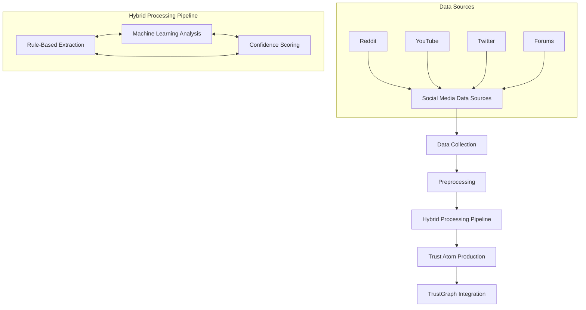
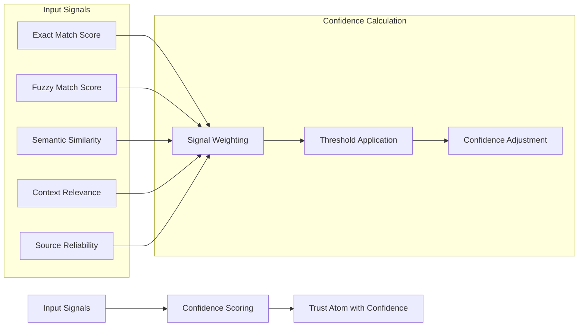

# Unstructured Data Processing Plan

This document outlines a comprehensive plan for processing unstructured data from social media sources like Reddit and YouTube to produce high-quality Trust Atoms for the TrustGraph architecture.

## Table of Contents

1. [Overview](#overview)
2. [Challenges with Unstructured Data](#challenges-with-unstructured-data)
3. [Hybrid Processing Approach](#hybrid-processing-approach)
4. [Pipeline Architecture](#pipeline-architecture)
5. [Implementation Details](#implementation-details)
6. [Evaluation and Refinement](#evaluation-and-refinement)
7. [Integration with TrustGraph](#integration-with-trustgraph)

## Overview

Unstructured data from social media platforms presents unique challenges for product matching and sentiment analysis. This plan outlines a hybrid approach that combines rule-based extraction with machine learning for confidence scoring and validation, addressing the 80-90% product matching failure rate in the current implementation.



## Challenges with Unstructured Data

### 1. Ambiguous Product References

Social media users rarely use precise product names, instead using:
- Abbreviated names ("CeraVe" instead of "CeraVe Foaming Facial Cleanser")
- Generic descriptions ("my face wash" or "that blue bottle cleanser")
- Misspellings ("Cerave", "Cera-V", "Cerave face wash")

### 2. Context-Dependent Mentions

Product mentions often depend on conversation context:
- References to previously mentioned products
- Replies that don't explicitly name the product
- Comparisons between multiple products

### 3. Mixed Sentiment and Nuance

User feedback often contains:
- Mixed positive and negative opinions
- Conditional recommendations ("great for oily skin but not dry skin")
- Comparisons ("better than X but not as good as Y")
- Temporal changes ("loved it at first but then...")

### 4. Source-Specific Challenges

Each platform has unique characteristics:

**Reddit:**
- Nested conversation threads
- Subreddit-specific terminology
- References to previous comments

**YouTube:**
- Comments referring to specific video timestamps
- Reactions to creator opinions
- Less structured discussions

## Hybrid Processing Approach

Our approach combines the strengths of rule-based systems (precision, explainability) with machine learning (flexibility, pattern recognition) to create a robust processing pipeline.

### Rule-Based Components

1. **Text Preprocessing**
   - Standardized cleaning and normalization
   - URL and special character removal
   - Sentence and paragraph segmentation

2. **Product Mention Detection**
   - Keyword and phrase matching from product registry
   - Brand name detection
   - Product type identification

3. **Context Extraction**
   - Conversation thread analysis
   - Reference resolution
   - Topic segmentation

### Machine Learning Components

1. **Semantic Similarity Matching**
   - Embedding-based product matching
   - Context-aware similarity scoring
   - Candidate ranking

2. **Sentiment Analysis**
   - Fine-tuned sentiment classification
   - Aspect-based sentiment analysis
   - Nuance detection

3. **Tag and Entity Extraction**
   - Named entity recognition
   - Topic modeling
   - Keyword extraction

### Confidence Scoring System

The confidence scoring system combines signals from both rule-based and ML components:



## Pipeline Architecture

The unstructured data processing pipeline consists of several stages, each with specific responsibilities:

### 1. Data Collection and Ingestion

```python
class DataCollector:
    """Collect data from various social media platforms"""
    
    def collect_from_reddit(self, subreddits, time_period, keywords=None):
        """
        Collect posts and comments from specified subreddits
        
        Args:
            subreddits (list): List of subreddit names
            time_period (str): Time period to collect (e.g., "day", "week", "month")
            keywords (list, optional): Keywords to filter by
            
        Returns:
            list: Collected data in unified format
        """
        # Implementation details
        pass
    
    def collect_from_youtube(self, channels, video_count, keywords=None):
        """
        Collect comments from specified YouTube channels
        
        Args:
            channels (list): List of channel IDs or names
            video_count (int): Number of recent videos to collect from
            keywords (list, optional): Keywords to filter by
            
        Returns:
            list: Collected data in unified format
        """
        # Implementation details
        pass
    
    def unify_data_format(self, raw_data, source):
        """
        Convert platform-specific data to unified format
        
        Args:
            raw_data (list): Raw data from platform API
            source (str): Source platform name
            
        Returns:
            list: Data in unified format
        """
        # Implementation details
        pass
```

### 2. Text Preprocessing

```python
class TextPreprocessor:
    """Preprocess text for further analysis"""
    
    def clean_text(self, text):
        """
        Clean text by removing URLs, special characters, etc.
        
        Args:
            text (str): Raw text
            
        Returns:
            str: Cleaned text
        """
        # Remove URLs
        text = re.sub(r'https?://\S+', '', text)
        
        # Remove special characters but keep apostrophes
        text = re.sub(r'[^\w\s\']', ' ', text)
        
        # Remove extra whitespace
        text = re.sub(r'\s+', ' ', text).strip()
        
        return text
    
    def segment_text(self, text):
        """
        Segment text into sentences and paragraphs
        
        Args:
            text (str): Cleaned text
            
        Returns:
            dict: Segmented text with sentences and paragraphs
        """
        # Split into paragraphs
        paragraphs = [p.strip() for p in text.split('\n') if p.strip()]
        
        # Split into sentences
        sentences = nltk.sent_tokenize(text)
        
        return {
            "full_text": text,
            "paragraphs": paragraphs,
            "sentences": sentences
        }
    
    def extract_context(self, text, thread=None):
        """
        Extract contextual information
        
        Args:
            text (str): Preprocessed text
            thread (list, optional): Conversation thread
            
        Returns:
            dict: Extracted context
        """
        # Implementation details
        pass
```

### 3. Product Mention Detection

```python
class ProductMentionDetector:
    """Detect product mentions in text"""
    
    def __init__(self, product_registry):
        """
        Initialize with product registry
        
        Args:
            product_registry (dict): Product registry with aliases
        """
        self.product_registry = product_registry
        
    def detect_mentions(self, segmented_text):
        """
        Detect potential product mentions
        
        Args:
            segmented_text (dict): Segmented text from preprocessor
            
        Returns:
            list: Detected product mentions
        """
        mentions = []
        
        # Check each sentence for product mentions
        for sentence in segmented_text["sentences"]:
            # Check for brand mentions
            for product_id, product in self.product_registry.items():
                brand = product.get("brand", "").lower()
                if brand and brand in sentence.lower():
                    # Find surrounding context
                    context = self._get_surrounding_context(sentence, segmented_text)
                    
                    mentions.append({
                        "text": sentence,
                        "brand": brand,
                        "context": context,
                        "product_type": None
                    })
                    
            # Check for product type mentions
            for product_id, product in self.product_registry.items():
                product_type = product.get("type", "").lower()
                if product_type and product_type in sentence.lower():
                    # Find surrounding context
                    context = self._get_surrounding_context(sentence, segmented_text)
                    
                    mentions.append({
                        "text": sentence,
                        "brand": None,
                        "context": context,
                        "product_type": product_type
                    })
        
        return mentions
    
    def _get_surrounding_context(self, sentence, segmented_text):
        """
        Get surrounding context for a sentence
        
        Args:
            sentence (str): Target sentence
            segmented_text (dict): Segmented text
            
        Returns:
            str: Context including surrounding sentences
        """
        # Implementation details
        pass
```

### 4. Multi-Stage Product Matching

```python
class ProductMatcher:
    """Match product mentions to canonical products"""
    
    def __init__(self, product_registry, embeddings=None):
        """
        Initialize with product registry and embeddings
        
        Args:
            product_registry (dict): Product registry
            embeddings (dict, optional): Pre-computed product embeddings
        """
        self.product_registry = product_registry
        self.embeddings = embeddings
        
    def match_product(self, mention):
        """
        Multi-stage product matching
        
        Args:
            mention (dict): Product mention
            
        Returns:
            tuple: (product_id, match_info)
        """
        # Stage 1: Exact Alias Match
        product_id, confidence = self._exact_alias_match(mention["text"])
        if product_id and confidence > 0.8:
            return product_id, self._create_match_info("exact_alias", confidence, mention)
        
        # Stage 2: Fuzzy Brand + Product Match
        product_id, confidence = self._fuzzy_brand_product_match(mention)
        if product_id and confidence > 0.6:
            return product_id, self._create_match_info("fuzzy_brand_product", confidence, mention)
        
        # Stage 3: Semantic Similarity
        if self.embeddings:
            product_id, confidence = self._semantic_similarity_match(mention)
            if product_id and confidence > 0.5:
                return product_id, self._create_match_info("semantic_similarity", confidence, mention)
        
        # No match found
        self._log_unmatched(mention)
        return None, None
    
    def _exact_alias_match(self, text):
        """Exact matching against product aliases"""
        # Implementation details
        pass
    
    def _fuzzy_brand_product_match(self, mention):
        """Fuzzy matching with brand detection"""
        # Implementation details
        pass
    
    def _semantic_similarity_match(self, mention):
        """Semantic similarity matching using embeddings"""
        # Implementation details
        pass
    
    def _create_match_info(self, method, score, mention):
        """Create match info object"""
        return {
            "match_method": method,
            "match_score": score,
            "alternative_matches": self._get_alternative_matches(mention),
            "context_factors": {
                "brand_mentioned": mention.get("brand") is not None,
                "product_type_mentioned": mention.get("product_type") is not None,
                "identifier_mentioned": self._has_identifier(mention["text"])
            }
        }
    
    def _get_alternative_matches(self, mention):
        """Get alternative matches with lower confidence"""
        # Implementation details
        pass
    
    def _has_identifier(self, text):
        """Check if text contains product identifiers"""
        # Implementation details
        pass
    
    def _log_unmatched(self, mention):
        """Log unmatched mentions for registry expansion"""
        # Implementation details
        pass
```

### 5. Sentiment and Tag Analysis

```python
class ContentAnalyzer:
    """Analyze content for sentiment and tags"""
    
    def analyze_sentiment(self, text):
        """
        Analyze sentiment using hybrid approach
        
        Args:
            text (str): Preprocessed text
            
        Returns:
            tuple: (sentiment_label, confidence)
        """
        # Rule-based approach for clear sentiment indicators
        positive_keywords = ["love", "great", "excellent", "amazing", "perfect", "recommend"]
        negative_keywords = ["hate", "terrible", "awful", "disappointing", "waste", "avoid"]
        
        text_lower = text.lower()
        
        # Count sentiment keywords
        positive_count = sum(1 for word in positive_keywords if word in text_lower)
        negative_count = sum(1 for word in negative_keywords if word in text_lower)
        
        # Rule-based decision
        if positive_count > 0 and negative_count == 0:
            return "positive", 0.8
        elif negative_count > 0 and positive_count == 0:
            return "negative", 0.8
        elif positive_count > 0 and negative_count > 0:
            return "mixed", 0.7
        
        # Fall back to ML-based sentiment analysis
        # sentiment, confidence = self._ml_sentiment_analysis(text)
        # return sentiment, confidence
        
        # For now, default to neutral with low confidence
        return "neutral", 0.5
    
    def extract_tags(self, text, category):
        """
        Extract relevant tags based on category
        
        Args:
            text (str): Preprocessed text
            category (str): Product category
            
        Returns:
            list: Extracted tags
        """
        # Category-specific tag dictionaries
        tag_dictionaries = {
            "skincare": {
                "skin_types": ["oily", "dry", "combination", "sensitive", "acne-prone"],
                "concerns": ["acne", "wrinkles", "redness", "dark spots", "blackheads"],
                "ingredients": ["retinol", "vitamin c", "hyaluronic acid", "niacinamide", "salicylic acid"]
            },
            "food": {
                "flavors": ["sweet", "savory", "spicy", "bitter", "sour"],
                "dietary": ["vegan", "gluten-free", "keto", "organic", "non-gmo"],
                "texture": ["crunchy", "smooth", "creamy", "crispy", "chewy"]
            }
        }
        
        # Get relevant dictionaries for the category
        category_dict = tag_dictionaries.get(category, {})
        
        tags = []
        # Check for matches in each tag type
        for tag_type, tag_list in category_dict.items():
            for tag in tag_list:
                if tag in text.lower():
                    tags.append(tag)
        
        return tags
    
    def _ml_sentiment_analysis(self, text):
        """ML-based sentiment analysis"""
        # Implementation details
        pass
```

### 6. Trust Atom Creation

```python
class TrustAtomCreator:
    """Create Trust Atoms from processed data"""
    
    def create_trust_atom(self, feedback, product_match_result, sentiment_result, tags):
        """
        Create a Trust Atom
        
        Args:
            feedback (dict): Raw feedback data
            product_match_result (tuple): (product_id, match_info)
            sentiment_result (tuple): (sentiment_label, confidence)
            tags (list): Extracted tags
            
        Returns:
            dict: Trust Atom
        """
        product_id, match_info = product_match_result
        sentiment_label, sentiment_confidence = sentiment_result
        
        # Generate a unique atom ID
        atom_id = f"{feedback['source']}_{product_id}_{uuid.uuid4().hex[:8]}"
        
        # Calculate overall confidence score
        # Weighted average of match confidence and sentiment confidence
        overall_confidence = 0.7 * match_info["match_score"] + 0.3 * sentiment_confidence
        
        # Create the Trust Atom
        atom = {
            "atom_id": atom_id,
            "product_id": product_id,
            "source": feedback['source'],
            "timestamp": feedback['timestamp'],
            "feedback_text": feedback['text'],
            "summary_text": self._summarize_text(feedback['text']),
            "sentiment_label": sentiment_label,
            "authenticity_score": self._calculate_authenticity(feedback),
            "confidence_score": overall_confidence,
            "tags": tags,
            "metadata": {
                "username_hash": self._anonymize_username(feedback.get('username')),
                "upvotes": feedback.get('score', 0),
                "permalink": feedback.get('permalink')
            },
            "product_match_info": match_info,
            "source_specific_data": self._get_source_specific_data(feedback)
        }
        
        return atom
    
    def _summarize_text(self, text):
        """Generate summary of text"""
        # Implementation details
        pass
    
    def _calculate_authenticity(self, feedback):
        """Calculate authenticity score"""
        # Implementation details
        pass
    
    def _anonymize_username(self, username):
        """Anonymize username"""
        # Implementation details
        pass
    
    def _get_source_specific_data(self, feedback):
        """Get source-specific data"""
        source_data = {}
        
        if feedback['source'] == 'reddit':
            source_data["reddit_data"] = {
                "subreddit": feedback.get('subreddit'),
                "post_title": feedback.get('post_title'),
                "post_score": feedback.get('post_score', 0)
            }
        elif feedback['source'] == 'youtube':
            source_data["youtube_data"] = {
                "video_title": feedback.get('video_title'),
                "channel_name": feedback.get('channel_name'),
                "video_views": feedback.get('video_views', 0),
                "timestamp_in_video": feedback.get('timestamp_in_video')
            }
        
        return source_data
```

### 7. Pipeline Orchestration

```python
class UnstructuredDataPipeline:
    """Orchestrate the unstructured data processing pipeline"""
    
    def __init__(self, product_registry, embeddings=None):
        """
        Initialize the pipeline
        
        Args:
            product_registry (dict): Product registry
            embeddings (dict, optional): Pre-computed product embeddings
        """
        self.preprocessor = TextPreprocessor()
        self.mention_detector = ProductMentionDetector(product_registry)
        self.product_matcher = ProductMatcher(product_registry, embeddings)
        self.content_analyzer = ContentAnalyzer()
        self.atom_creator = TrustAtomCreator()
        
    def process_feedback(self, feedback):
        """
        Process a single feedback item
        
        Args:
            feedback (dict): Raw feedback data
            
        Returns:
            list: Trust Atoms generated from feedback
        """
        # Step 1: Preprocess text
        cleaned_text = self.preprocessor.clean_text(feedback['text'])
        segmented_text = self.preprocessor.segment_text(cleaned_text)
        
        # Step 2: Detect product mentions
        mentions = self.mention_detector.detect_mentions(segmented_text)
        
        # No product mentions found
        if not mentions:
            return []
        
        trust_atoms = []
        
        # Process each mention
        for mention in mentions:
            # Step 3: Match product
            product_match_result = self.product_matcher.match_product(mention)
            
            # No product match found
            if not product_match_result[0]:
                continue
            
            # Step 4: Analyze sentiment and extract tags
            sentiment_result = self.content_analyzer.analyze_sentiment(mention['text'])
            product_id = product_match_result[0]
            product_category = self._get_product_category(product_id)
            tags = self.content_analyzer.extract_tags(mention['text'], product_category)
            
            # Step 5: Create Trust Atom
            trust_atom = self.atom_creator.create_trust_atom(
                feedback,
                product_match_result,
                sentiment_result,
                tags
            )
            
            trust_atoms.append(trust_atom)
        
        return trust_atoms
    
    def process_batch(self, feedback_batch):
        """
        Process a batch of feedback items
        
        Args:
            feedback_batch (list): List of raw feedback data
            
        Returns:
            list: Trust Atoms generated from batch
        """
        all_atoms = []
        
        for feedback in feedback_batch:
            atoms = self.process_feedback(feedback)
            all_atoms.extend(atoms)
        
        return all_atoms
    
    def _get_product_category(self, product_id):
        """Get category for a product"""
        # Implementation details
        pass
```

## Evaluation and Refinement

### Evaluation Metrics

1. **Product Matching Accuracy**
   - Precision: Correctly matched products / Total matched products
   - Recall: Correctly matched products / Total product mentions
   - F1 Score: Harmonic mean of precision and recall

2. **Sentiment Analysis Accuracy**
   - Agreement with human-labeled sentiment
   - Confusion matrix for sentiment categories

3. **Tag Extraction Quality**
   - Precision: Correctly extracted tags / Total extracted tags
   - Recall: Correctly extracted tags / Total relevant tags
   - Tag relevance score

4. **Overall Trust Atom Quality**
   - Confidence score distribution
   - Human evaluation of random samples
   - Consistency across data sources

### Refinement Process

1. **Error Analysis**
   - Categorize and analyze matching failures
   - Identify patterns in sentiment misclassifications
   - Review low-confidence Trust Atoms

2. **Registry Expansion**
   - Analyze unmatched mentions for new products
   - Generate aliases from common references
   - Update registry with new products and aliases

3. **Algorithm Tuning**
   - Adjust confidence thresholds based on performance
   - Fine-tune ML models with new training data
   - Optimize rule-based components

## Integration with TrustGraph

### Trust Atom Storage

Trust Atoms will be stored in category-specific JSON files:

```
trustlayer_plugin/
├── data/
│   ├── trust_atoms/
│   │   ├── skincare.json
│   │   ├── food.json
│   │   └── household.json
```

### Graph Building

The TrustGraph will be built from Trust Atoms using the following process:

1. **Node Creation**
   - Create nodes for products, sources, tags, etc.
   - Assign properties based on Trust Atom data

2. **Edge Creation**
   - Create edges between nodes based on relationships
   - Assign edge weights based on confidence scores

3. **Graph Traversal**
   - Implement traversal algorithms for related products
   - Develop aggregation for multi-source trust

### API Integration

The TrustGraph will be exposed through a simple API:

```python
class TrustGraphAPI:
    """API for interacting with the TrustGraph"""
    
    def get_product_trust(self, product_id):
        """
        Get trust information for a product
        
        Args:
            product_id (str): Product ID
            
        Returns:
            dict: Trust information
        """
        # Implementation details
        pass
    
    def get_related_products(self, product_id, relationship_type=None):
        """
        Get related products
        
        Args:
            product_id (str): Product ID
            relationship_type (str, optional): Type of relationship
            
        Returns:
            list: Related products
        """
        # Implementation details
        pass
    
    def get_product_sentiment(self, product_id):
        """
        Get sentiment distribution for a product
        
        Args:
            product_id (str): Product ID
            
        Returns:
            dict: Sentiment distribution
        """
        # Implementation details
        pass
```

## Implementation Timeline

### Phase 1: Foundation (Weeks 1-2)
- Set up data collection from Reddit and YouTube
- Implement text preprocessing
- Create basic product mention detection

### Phase 2: Core Pipeline (Weeks 3-5)
- Implement multi-stage product matching
- Develop sentiment and tag analysis
- Create Trust Atom generation

### Phase 3: Evaluation and Refinement (Weeks 6-7)
- Evaluate pipeline performance
- Refine algorithms based on results
- Expand product registry

### Phase 4: TrustGraph Integration (Weeks 8-10)
- Implement TrustGraph building
- Develop graph traversal algorithms
- Create API for graph access

## Conclusion

This plan provides a comprehensive approach to processing unstructured data from social media sources, addressing the challenges of product matching and sentiment analysis. By combining rule-based extraction with machine learning for confidence scoring and validation, we can significantly improve the quality of Trust Atoms and build a robust foundation for the TrustGraph architecture.

The hybrid approach allows us to leverage the strengths of both paradigms:
- Rule-based components provide precision and explainability
- Machine learning components add flexibility and pattern recognition
- Confidence scoring ensures data quality and reliability

With this implementation, we can address the 80-90% product matching failure rate in the current system and create a solid foundation for the TrustGraph-based architecture.